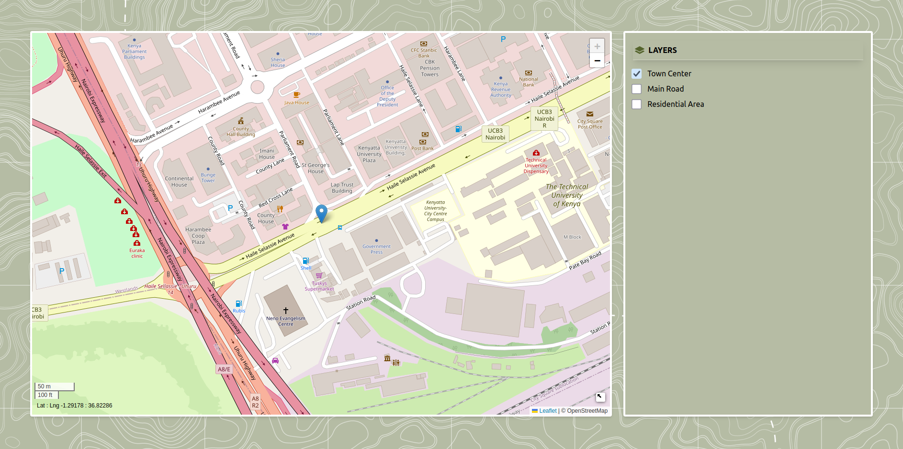

# React Leaflet Map with Layers

A fully interactive **Leaflet map** built with React, featuring multiple **GeoJSON layers**, map controls, and layer toggling functionality.

---

## **Features**

- Interactive map with **Leaflet** and **React-Leaflet**.  
- Toggleable **GeoJSON layers** (e.g., town centers, roads, residential areas).  
- Useful **map controls**:  
  - Mini-map  
  - Zoom  
  - Mouse position  
  - Scale  
- **Automatic zoom** to fit visible layers.  
- Styled with **TailwindCSS** for a clean, responsive UI.

---

## **Demo**




---

## **Getting Started**

### **1. Clone the repository**

```bash
git clone https://github.com/WanjikuN/Mapping.git
cd Mapping

```

### **2. Install dependencies**

```bash
npm install
```

### **3. Run the development server**

```bash
npm run dev
```

### **4. Running Tests**

Run all tests:

```bash
npx vitest
```

Run tests in watch mode:

```bash
npx vitest --watch
```

Run tests with coverage:

```bash
npx vitest --coverage
```

---

#### For a detailed step-by-step guide, check out my Medium article

[Adding Layers to a Map in React Using Leaflet](https://medium.com/@wanjikunpatricia/adding-layers-to-a-map-in-react-using-leaflet-0e8e3ce038e7)
